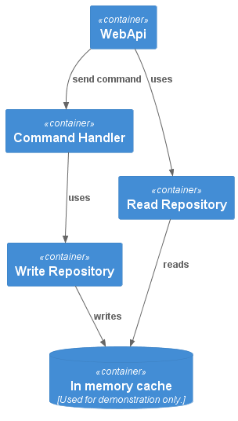

# CQRS.Shop.WebApi

## Objective

This project aims to demonstrate how to implement the CQRS (Command Query Responsibility Segregation) pattern.
For demonstration purpose it uses an in memory cache to saves data.

## How to run

You just need to execute in the Web Api project folder:
`dotnet run`

You can access the web api at:
`https://localhost:7222/swagger/index.html`

## Web API
Three endpoints are available at the moment:

`[GET] /cart/{idCart}`
: Returns a cart by ID {idCart}

`[PUT] /cart/{idCart}`
: Creates a new cart with ID {idCart}

`[POST] /cart/{idCart}/item`
: Updates the cart {idCart} by adding an item to its items list by adding an item
